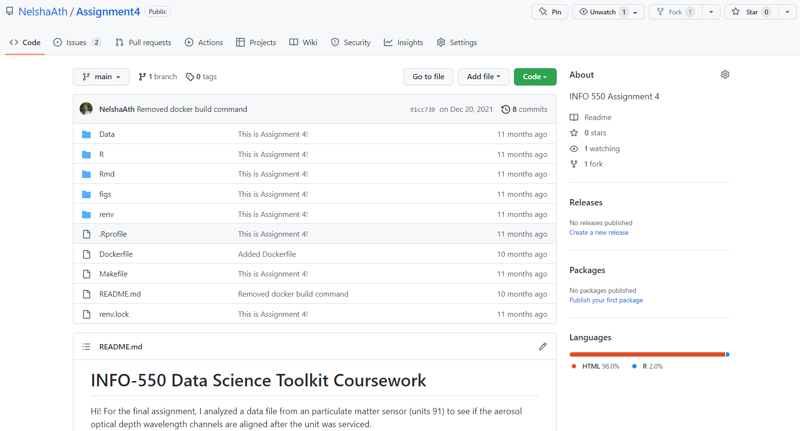
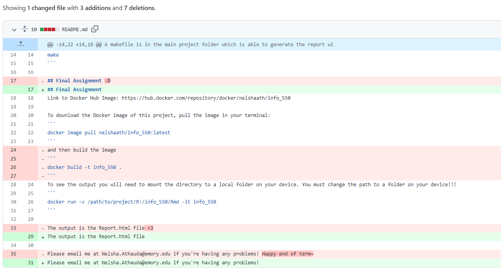
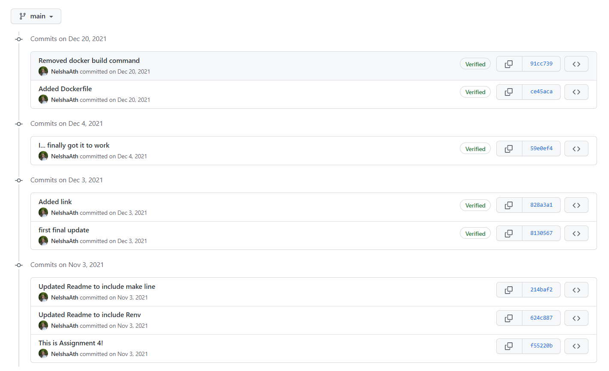
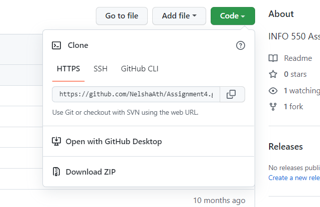
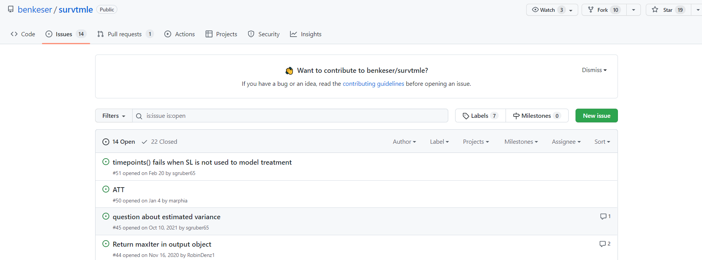
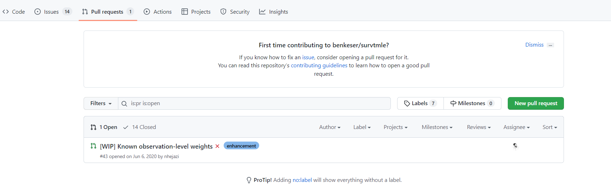
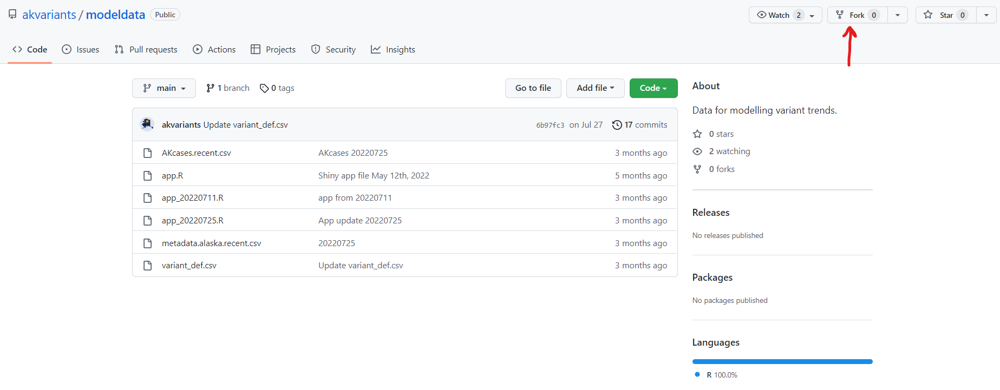

```{r setup, include=FALSE}
options(htmltools.dir.version = FALSE)
```


## What is Github?

"The complete developer platform to build, scale, and deliver secure software."

- Data Analysis
- Version History
  - See history of changes made to a document
  - Revert to older versions of a document
  - Try new things out without breaking things that work
- Collaboration

tl;dr: Stop saving fifty copies of the same file with different names

---

## Terminology

- Repository
  - A directory of (ideally) plain-text files (.html, .txt, .R, .Rmd, etc.) 
  included in a project
- Commit
  - A unique flag for a particular state of your project
  - Every push to the server is an updated version = a new commit
- History
  - All of the commits for a project

---

## Example repository



This is a repository of the code that I wrote for my Data Science Toolkit Final
Exam. It compares data across two collocated air quality samplers. 
The repository is the directory of files. The README.md file describes the 
project and how to run it. 

---

## Example commit



If you click on a commit on GitHub, you can  see what lines 
were modified. 
The old version appears in red and the new version
in green. 

---

## Commit History



This is the full project history, each commit is a different version.

---

## Using a terminal

Unless you want to upload your files directly to the website (inconvenient), 
you will need to learn how to use your computer's terminal. 

All devices have a command line (Command Prompt) but you can download a WSL 
(Windows Subsystem for Linux) like Ubuntu which can download R itself and be 
used as a one-stop console and terminal. 

WSL or Command Prompt can be selected in your IDE (I use RStudio or Sublime 
Text Editor 4)

---

## Starting with Github

Go to https://github.com/ and create a GitHub account. Also go into your 
settings and create a PAT (Personal Access Token) which will be required
to access your Github account from a terminal. 

Copy and paste your PAT somewhere easy to find or you'll have to make a 
new one!!

---

## Using Simple bash commands to create a local directory

```{bash, eval = F, echo=T}
cd ~/Desktop # Change Directory to where your project is 
mkdir myproject # Make directory titled ___
cd myproject/ # Navigate to the project

git init # Initialize repository
```

Important: For any file addresses, use forward slashes only! A back slash in bash means to disregard the next character (used if you have spaces in the address)

Copied from File explorer: 
C:\Users\nrathauda\OneDrive - University of Alaska\R

Adapted to bash: 
C:/Users/nrathauda/OneDrive\ -\ University\ of\ Alaska/R
---

## Maintain your local repository

```{bash, eval = F, echo=T}
git status # shows what files have changed since your last commit
git add # tell git which files to add to this commit
git add . # Adds all files in the folder 
git commit -m "I fixed so many things!" 
# make a commit with a message `-m`
git push origin main # New terminology is to name a branch 'Main'
push the master branch to the origin remote
```

---

## Create a online repository (GitHub)

GitHub is the online platform. Create a repository on the website and copy the 
HTTPS share link to create a remote (bridge) between the Hub and your local 
repository




```{bash, eval = F, echo=T}
git remote add origin https://github.com/[your-username]/[repository-name.git]
git push -u origin main 
# Pushing your origin (local repo) to the Hub (online repo) on the Main branch
```

---

## Check your GitHub profile 

If everything pushed successfully, there should be a recent commit!

.center[]

---

## Using Branches

If you want to try something risky but don't want to mess up your current working code you can use branches
Commit the working version on your normal branch (Main)
Start working on your risky changes but commit the updates to a new branch (Ex. Branch1)
If your new branch works out, you can merge the changes you made onto your original Main branch

```{bash, eval = F, echo=T}
# make a branch called Branch1
git branch Branch1
# checkout is used to switch between branches
git checkout Branch1
# see all branches
git branch
```

---

## Using Branches (cont.)

Both branches can be edited, merging will add/delete to the branch you want it to act on

```{bash, eval = F, echo=T}
# Switch back to the original branch
git checkout Main
# Merge the changes on Branch1 to Main 
git merge Branch1
```

Merge conflicts will come up if you edited the same lines in different branches and will have to be resolved manually (git will show you which lines)

---

## Other ways to collaborate

If you notice a bug in someone's code you can file an issue (Similar to a YouTube comment)

.center[]

Or you can create a pull request

- Fork the repo on GitHub
- git clone to download to local machine
- Modify code (read contributing guidelines first!)
- Commit changes
- git push back to GitHub
- Submit a pull request

---

## Pull Request Workflow

```{bash, eval = F, echo=T}
# add friend's repo as a remote branch
git remote add wrongdoer https://github.com/wrongdoer/repo
# downloads friend's branch, but do not merge it yet
git fetch wrongdoer master
# view all local and remote branches
git branch -a
# checkout friends remote branch
git checkout remotes/wrongdoer/master
# make a local branch based on friend's repo
git checkout -b wrongdoer
# test out the branch; make sure it works as expected
[...]
# checkout local master, merge, push
git checkout master
git merge wrongdoer
git push origin master
```

Now the fixed code is in YOUR repository

---

To give the fixed code to the person who created the version with a bug, create a pull request on Github, in their repository

.center[]

---

## On the receiving end of a pull request?

Merge it on GitHUb itself
To add it to your local copy, git fetch or git pull

git fetch
 - Download code separately from your local repository.
 - Explicitly merge into your local repository.

git pull
 - fetch and merge at the same time
 - Faster, but you can't verify that the code works before changing your local repository.

---

## Want to see/use/adapt someone else's code?

Find the repository on GitHub and fork it to create a copy that you can alter.

.center[]

To bring the copy to your local device, use git clone

```{bash, eval = F, echo=T}
git clone https://github.com/Your-name/The-Forks-name
```


---

## Goal: Recode the Bridged race categories in a way that respects people reporting more than one race, for pre-2013 shift in race categories

---

##Option 1

### Incorporate bridged race variables into the category they were bridged to

Ex. 

Bridged Black -> Black
Bridged AI/AN -> AI/AN
Bridged Asian AND PI -> Randomly distributed into Asian or PI based on a ratio
Bridged White -> White

Pros: Simple

Cons: Loses any nuance in outcomes for people reporting more than one race

---

## Option 2

### Add weights to each record reporting more than one race

Build a weight system, multiply records, assign each duplicate record with a weight and different race

Ex. Each Bridged Black record -> 0.5 Black, 0.25 White, 0.11 AI/AN, etc.

Pros: Will be fine for simple counts, distributing into more than one race equally as we don't know what other race category they would have selected if they had the option

Cons: Will make other analysis really difficult

---

## Option 3

### Combine all bridged records into one large 'More than one race' category

Pros: Parsimonious, acknowledges that there is a different experience, already written code, what AK Vital Records will be doing after this year

Cons: No nuance between the exact race categories but we don't have that info anyways, complies with the NIH desired race variables


